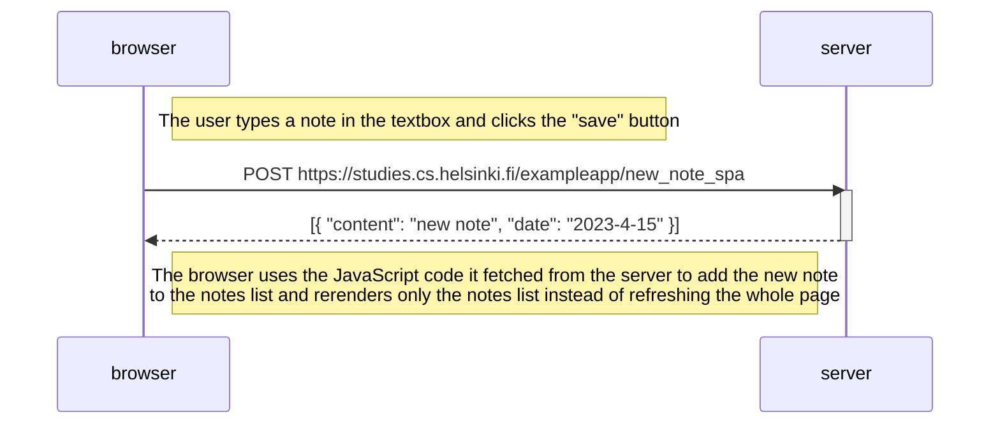

```mermaid
sequenceDiagram
    participant browser
    participant server

    Note right of browser: The user types a note in the textbox and clicks the "save" button

    browser->>server: POST https://studies.cs.helsinki.fi/exampleapp/new_note_spa
    activate server
    server-->>browser: [{ "content": "new note", "date": "2023-4-15" }]
    deactivate server

    Note right of browser: The browser uses the JavaScript code it fetched from the server to add the new note <br> to the notes list and rerenders only the notes list instead of refreshing the whole page
```